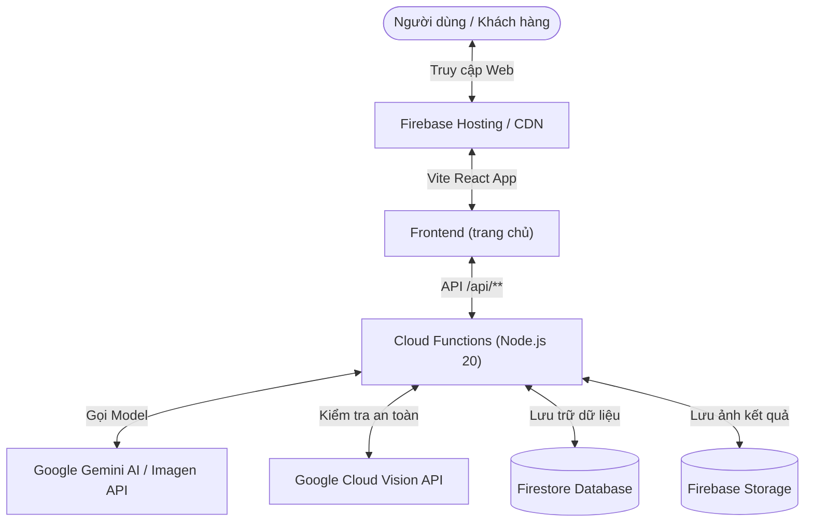

# HƯỚNG DẪN CHẠY HỆ THỐNG VÀ DEPLOY LÊN GITHUB & FIREBASE
> **Dự án**: VINPhotobooth (VinPalace / MSB Photo & AI Experience)  
> **Cập nhật ngày**: 25/08/2026

---

## 📑 MỤC LỤC
1. [Tổng quan Kiến trúc Hệ thống](#1-tổng-quan-kiến-trúc-hệ-thống)
2. [Yêu cầu Môi trường](#2-yêu-cầu-môi-trường)
3. [Hướng dẫn Cài đặt & Chạy Localhost (Dev)](#3-hướng-dẫn-cài-đặt--chạy-localhost-dev)
   - [3.1. Chạy Frontend (Giao diện React Vite)](#31-chạy-frontend-giao-diện-react-vite)
   - [3.2. Chạy Backend / Firebase Functions](#32-chạy-backend--firebase-functions)
4. [Hướng dẫn Quản lý Git & Đẩy code lên GitHub](#4-hướng-dẫn-quản-lý-git--đẩy-code-lên-github)
   - [4.1. Cấu hình ban đầu](#41-cấu-hình-ban-đầu)
   - [4.2. Quy trình đẩy code lên Git định kỳ](#42-quy-trình-đẩy-code-lên-git-định-kỳ)
   - [4.3. Lưu ý bảo mật Git (.gitignore)](#43-lưu-ý-bảo-mật-git-gitignore)
5. [Hướng dẫn Triển khai (Deploy) lên Firebase Production](#5-hướng-dẫn-triển-khai-deploy-lên-firebase-production)
   - [5.1. Đăng nhập Firebase CLI](#51-đăng-nhập-firebase-cli)
   - [5.2. Deploy Hosting (Frontend)](#52-deploy-hosting-frontend)
   - [5.3. Deploy Functions (Backend API)](#53-deploy-functions-backend-api)
   - [5.4. Deploy toàn bộ hệ thống](#54-deploy-toàn-bộ-hệ-thống)
6. [Xử lý Lỗi Thường Gặp (Troubleshooting)](#6-xử-lý-lỗi-thường-gặp-troubleshooting)

---

## 1. TỔNG QUAN KIẾN TRÚC HỆ THỐNG

Hệ thống hoạt động theo mô hình tích hợp **Frontend SPA + Firebase Serverless Backend**:



* **Thư mục source code chính**: `e:\vinplacephoto\trang chủ\`
* **Frontend**: React 18 + TypeScript + Vite 6 + Tailwind CSS v4.
* **Backend Functions**: Firebase Cloud Functions (Node.js 20) + Google GenAI SDK (Gemini) + Cloud Vision API.
* **Database & Storage**: Google Firestore & Firebase Cloud Storage (`vinpalace-df621`).
* **Git Repository**: `https://github.com/quangurah/VINPhotobooth.git` (nhánh `main`).

---

## 2. YÊU CẦU MÔI TRƯỜNG

Trước khi chạy hệ thống, đảm bảo máy tính đã cài đặt:

1. **Node.js**: Phiên bản **`v20.x`** trở lên ([Tải tại nodejs.org](https://nodejs.org/)).
   ```bash
   node -v
   npm -v
   ```
2. **Git**: Phiên bản mới nhất ([Tải tại git-scm.com](https://git-scm.com/)).
   ```bash
   git --version
   ```
3. **Firebase CLI**: Công cụ triển khai Firebase.
   ```bash
   npm install -g firebase-tools
   firebase --version
   ```

---

## 3. HƯỚNG DẪN CÀI ĐẶT & CHẠY LOCALHOST (DEV)

### 3.1. Chạy Frontend (Giao diện React Vite)

**Bước 1**: Mở Terminal (PowerShell hoặc Command Prompt) và di chuyển vào thư mục `trang chủ`:
```bash
cd "e:\vinplacephoto\trang chủ"
```

**Bước 2**: Cài đặt các gói thư viện (nếu chưa cài đặt hoặc có package mới):
```bash
npm install
```

**Bước 3**: Khởi động máy chủ phát triển (Dev Server):
```bash
npm run dev
```

- Màn hình terminal sẽ xuất hiện đường dẫn truy cập cục bộ:
  ```
  VITE v6.3.5  ready in 350 ms

  ➜  Local:   http://localhost:5173/
  ➜  Network: use --host to expose
  ```
- Mở trình duyệt và truy cập: **`http://localhost:5173/`**

---

### 3.2. Chạy Backend / Firebase Functions (Nếu cần test cục bộ)

**Bước 1**: Di chuyển vào thư mục `functions`:
```bash
cd "e:\vinplacephoto\trang chủ\functions"
npm install
```

**Bước 2**: Khởi chạy Firebase Emulator (tại thư mục `trang chủ`):
```bash
cd "e:\vinplacephoto\trang chủ"
firebase emulators:start --only functions
```

> [!NOTE]
> - Khi chạy chế độ phát triển thông thường (Localhost), Functions Emulator được cấu hình chạy ở cổng **`6000`** (tránh xung đột với cổng `5000` / `5005` của các ứng dụng khác).
> - Khi triển khai (Deploy Production), ứng dụng **tự động** chuyển sang endpoint Cloud chính thức (`https://api-phn3coaacq-as.a.run.app`), hoàn toàn không phụ thuộc vào cổng localhost.

---

## 4. HƯỚNG DẪN QUẢN LÝ GIT & ĐẨY CODE LÊN GITHUB

Repository Git được khởi tạo và quản lý trực tiếp tại thư mục `trang chủ`.

### 4.1. Cấu hình ban đầu (Chỉ thực hiện 1 lần nếu máy mới)
```bash
cd "e:\vinplacephoto\trang chủ"

# Cài đặt tên và email của bạn trên Git
git config --global user.name "Tên của bạn"
git config --global user.email "email_cua_ban@example.com"
```

### 4.2. Quy trình đẩy code lên Git định kỳ

Mỗi khi bạn hoàn thành một tính năng hoặc sửa lỗi, thực hiện các bước sau:

**Bước 1**: Di chuyển vào thư mục code chính:
```bash
cd "e:\vinplacephoto\trang chủ"
```

**Bước 2**: Kiểm tra các file đã thay đổi:
```bash
git status
```

**Bước 3**: Thêm toàn bộ các file thay đổi vào staging:
```bash
git add .
```

**Bước 4**: Tạo commit ghi rõ nội dung thay đổi:
```bash
git commit -m "feat: cập nhật tính năng mới / fix: sửa lỗi..."
```

**Bước 5**: Đẩy code lên nhánh chính (`main`) trên GitHub:
```bash
git push origin main
```

---

### 4.3. Lưu ý bảo mật Git (`.gitignore`)

> [!CAUTION]
> **TUYỆT ĐỐI KHÔNG COMMIT CÁC FILE CHỨA KHÓA BẢO MẬT**:
> - `functions/api_keys.json`
> - `functions/sake.json`
> - `*.env`, `.env.local`
> - `*serviceAccount*.json`
> 
> File `.gitignore` trong thư mục `trang chủ` đã được cấu hình tự động loại trừ các file này. Trước khi commit, luôn chạy `git status` để kiểm tra chắc chắn không có file credentials nào bị đưa lên repository công khai.

---

## 5. HƯỚNG DẪN TRIỂN KHAI (DEPLOY) LÊN FIREBASE PRODUCTION

Dự án sử dụng Firebase Project: **`vinpalace-df621`**.

### 5.1. Đăng nhập Firebase CLI
```bash
firebase login
```
*(Trình duyệt sẽ mở ra để bạn đăng nhập vào tài khoản Google sở hữu quyền quản trị dự án Firebase).*

---

### 5.2. Deploy Hosting (Frontend)

Mỗi khi cập nhật giao diện web:

**Bước 1**: Đứng tại thư mục `trang chủ` và đóng gói ứng dụng:
```bash
cd "e:\vinplacephoto\trang chủ"
npm run build
```
*(Thư mục `dist/` tối ưu cho production sẽ được tạo ra).*

**Bước 2**: Triển khai lên Firebase Hosting:
```bash
firebase deploy --only hosting
```

Sau khi hoàn tất, terminal sẽ hiển thị URL chính thức:
```
✔  Deploy complete!

Project Console: https://console.firebase.google.com/project/vinpalace-df621/overview
Hosting URL: https://vinpalace-df621.web.app
```

---

### 5.3. Deploy Functions (Backend API)

Khi có thay đổi logic xử lý AI, tạo ảnh, prompt, lọc an toàn (Safe Search) trong thư mục `functions/`:

```bash
cd "e:\vinplacephoto\trang chủ"
firebase deploy --only functions
```

Hoặc nếu chỉ muốn deploy một hàm cụ thể (ví dụ hàm `api`):
```bash
firebase deploy --only functions:api
```

---

### 5.4. Deploy Toàn Bộ Hệ Thống (Frontend + Backend + Storage)

Để triển khai đồng thời cả Hosting, Functions và Storage Rules:

```bash
cd "e:\vinplacephoto\trang chủ"
npm run build
firebase deploy
```

---

## 6. XỬ LÝ LỖI THƯỜNG GẶP (TROUBLESHOOTING)

### Lỗi 1: `fatal: not a git repository`
- **Nguyên nhân**: Bạn đang đứng ở thư mục gốc `e:\vinplacephoto` thay vì `e:\vinplacephoto\trang chủ`.
- **Cách xử lý**: Chạy `cd "e:\vinplacephoto\trang chủ"` trước khi dùng các lệnh git.

### Lỗi 2: `firebase: command not found`
- **Nguyên nhân**: Chưa cài đặt công cụ Firebase Tools toàn cục.
- **Cách xử lý**: Chạy `npm install -g firebase-tools`.

### Lỗi 3: Lỗi build Vite `npm run build` báo lỗi TypeScript / Modules
- **Cách xử lý**:
  1. Xóa thư mục `node_modules` và file `package-lock.json`
  2. Chạy lại `npm install`
  3. Chạy lại `npm run build`

### Lỗi 4: Git Push bị từ chối (Updates were rejected because the remote contains work)
- **Cách xử lý**: Kéo code mới nhất từ GitHub về trước rồi mới đẩy lên:
  ```bash
  git pull origin main --rebase
  git push origin main
  ```

---
*Tài liệu hướng dẫn được biên soạn chuẩn hóa cho dự án VINPhotobooth.*
